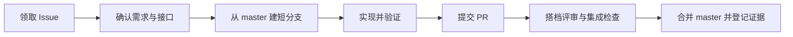

# WEMOVE SPORTS 网站重构

这是“软件开发实践 2”的六人小组项目仓库，用于共同完成 WEMOVE 品牌网站的需求、设计、实现、测试和课程交付。

**我们的协作方式：每人负责一个完整业务模块，先约定接口，再通过短期分支和 Pull Request 持续集成。** 一个模块包含自己的用户页面、后台管理页面、业务服务、数据设计和测试。

## 先了解项目现在在哪里

| 项目 | 当前情况 |
| --- | --- |
| 项目阶段 | 需求与协作基线已建立；A、B 已进入集成实现阶段 |
| 需求基线 | SRS V1.1，文档标记为“评审通过” |
| 协作设计 | 建议执行稿；姓名、GitHub 账号和实际日期仍需登记，当前技术栈见下文 |
| 应用实现 | `project-implementation/apps/` 包含统一的前端与后端；接口契约、脚本、测试设计和文档分别归入专门目录，按业务模块保留贡献记录 |
| 默认主线 | `master` |
| 验证状态 | A、B 已有各自验证记录；成员测试用例审核稿仍为待审核、未执行，整体验收以实际执行证据为准 |

项目面向成年消费者和采购人员，首期完成商品与内容展示、账户权限、模拟零售交易、经销申请与询价、客户咨询及运营后台。支付、退款和发货均为**明确标识的模拟流程**；真实支付、正式经销订单、企业子账号等不属于本期范围。

当前集成应用采用一个 Vue 3 + TypeScript 前端、一个按业务划分模块的 Java 21 + Spring Boot 后端，以及 MySQL 8 数据库，数据库迁移由 Flyway 管理。A、B 共用这套应用，后续模块在现有底座上接入。

## 第一次加入：按这个顺序阅读

| 文档 | 解决的问题 |
| --- | --- |
| [工程入口与运行指南](project-implementation/README.md) | 源码、契约、脚本和测试放在哪里，如何启动和验证 |
| [网站重构需求文档](project-implementation/project-requirements/WEMOVE网站重构需求文档.md) | 做什么、哪些不做、角色权限和业务规则是什么 |
| [团队分工与协作规范](project-implementation/project-requirements/WEMOVE团队分工与协作规范.md) | 谁负责什么、模块如何组合、分支和评审怎么进行 |
| [接口与数据协作契约](project-implementation/project-requirements/WEMOVE接口与数据协作契约.md) | 字段、接口、错误、状态、事务与数据库边界如何统一 |
| [需求责任与验收追踪表](project-implementation/project-requirements/WEMOVE需求责任与验收追踪表.md) | 谁实现、谁复核、用什么证据证明完成 |
| [成员测试用例审核总览](project-implementation/tests/cases/WEMOVE成员测试用例审核总览.md) | A—F 各自怎么测、跨成员流程怎么验证；当前为待审核、未执行的测试设计 |

文档中 **FR** 是功能需求，**BR** 是业务规则，**NFR** 是质量要求，**TC** 是测试场景，**UC** 是业务用例。任务和 PR 应引用这些编号，例如“实现 FR-14，验证 TC-15、TC-16、TC-17”。

README 提供入门指引，详细定义由上述文档维护。发现不一致时在 Issue 中记录并同步修订，不能只在聊天里约定一个新版本。

## 仓库里有什么

以下目录和文件目前已经存在：

| 位置 | 内容与用途 |
| --- | --- |
| [course-materials/](course-materials/) | 教师提供的网站重构要求、课程说明；原始资料保留在此 |
| [project-implementation/ideation/](project-implementation/ideation/) | 早期构想；当前实施范围以 SRS 为准 |
| [项目进度与流程资料](project-implementation/project_flowchart_view/) | 共享的甘特图 PDF 和可编辑 Excel 文件 |
| [前端设计视觉参考](project-implementation/前端设计视觉参考/) | 共享的前端风格参考图片 |
| [project-implementation/project-requirements/](project-implementation/project-requirements/) | 团队撰写的需求、分工、接口与验收文档 |
| [references/](project-implementation/project-requirements/references/) | 需求文档的模板与参考资料 |
| [project-implementation/apps/](project-implementation/apps/) | 统一应用源码：`web/` 为前端，`api/` 为后端；各业务模块在对应应用中实现 |
| [project-implementation/contracts/openapi/](project-implementation/contracts/openapi/) | 按身份账户、商品库存等业务模块维护的 OpenAPI 契约 |
| [project-implementation/scripts/smoke/](project-implementation/scripts/smoke/) | 身份账户和商品库存的 API 冒烟脚本 |
| [project-implementation/docs/](project-implementation/docs/) | 模块设计与贡献记录、设计参考、验证截图 |
| [project-implementation/tests/cases/](project-implementation/tests/cases/) | A—F 成员测试用例、跨成员集成用例及审核总览；执行前先审核 |
| [AGENTS.md](AGENTS.md) | 仓库目录、文档和贡献约定，使用开发助手时同样遵守 |

**目录按工程职责组织，成员按业务职责协作。** 前端、后端、接口契约和测试分别有稳定入口；成员归属由需求追踪表和模块文档记录。更换负责人时，代码位置无需随姓名或成员编号改变。所有模块共用现有应用和数据库迁移机制。

| 工作 | 实际入口 |
| --- | --- |
| 前端页面与组件 | [apps/web/src/](project-implementation/apps/web/src/)；商品模块入口为 [features/catalog/](project-implementation/apps/web/src/features/catalog/) 及商品相关页面 |
| 后端业务服务 | [apps/api/src/main/java/](project-implementation/apps/api/src/main/java/)；现有 Java 包名保持兼容，商品库存代码位于 [identity/catalog/](project-implementation/apps/api/src/main/java/com/wemove/identity/catalog/) |
| 数据库迁移 | [db/migration/](project-implementation/apps/api/src/main/resources/db/migration/)；V1 为身份底座，V2 为商品与库存 |
| 接口契约 | [身份账户 OpenAPI](project-implementation/contracts/openapi/identity.yaml)、[商品库存 OpenAPI](project-implementation/contracts/openapi/catalog.yaml) |
| 自动化测试 | [后端测试](project-implementation/apps/api/src/test/)、前端 `src/` 中的 `*.spec.ts`；单元测试随源码维护 |
| API 冒烟脚本 | [身份账户](project-implementation/scripts/smoke/identity-api.sh)、[商品库存](project-implementation/scripts/smoke/catalog-api.ps1) |
| 页面素材与截图 | [前端公共素材](project-implementation/apps/web/public/)、[身份页面参考](project-implementation/docs/design/references/identity/)、[商品验证截图](project-implementation/docs/verification/catalog/) |

### 写代码前先确认路径

本仓库的应用代码统一放在 `project-implementation/` 中。**仓库根目录**是本 README 所在目录；**工程根目录**是 `project-implementation/`。因此工程说明中的 `apps/web/`，从仓库根目录定位时应写成 `project-implementation/apps/web/`。本文运行命令以仓库根目录为起点。

- 前端统一进入 `project-implementation/apps/web/`，后端统一进入 `project-implementation/apps/api/`；不在仓库根目录另建应用，也不再按 `partA/`、`partB/` 等成员编号存放代码。
- 新业务按 `identity`、`catalog`、`commerce`、`dealership`、`content`、`support`／`operations` 接入现有工程。具体页面、路由、Java 包、测试、迁移和文档位置见[新增工作存放约定](project-implementation/README.md#新增工作放在哪里)。
- 从旧分支继续开发时，先核对[旧路径对照表](project-implementation/README.md#旧路径如何对应)，避免合并时恢复旧目录。成员分工记录在文档中，所有成员复用同一套应用入口、环境模板和依赖清单。

完整目录规则与命令以[工程 README](project-implementation/README.md)为准；详细起点解释见[路径约定](project-implementation/README.md#路径约定先确认起点)。现有模块的设计、成员贡献和验收记录分别见[身份账户模块](project-implementation/docs/modules/identity/README.md)与[商品库存模块](project-implementation/docs/modules/catalog/README.md)。

## 六人如何分工

A—F 暂为成员占位符。确定成员后，在分工文档和追踪表中登记姓名、GitHub 账号及评审搭档。

| 成员 | 业务模块 | 同时承担的公共工作 |
| --- | --- | --- |
| A | 身份与账户：注册、登录、权限、资料、用户管理 | 工程底座、环境、统一请求/认证、CI 和迁移执行入口 |
| B | 商品与库存：搜索筛选、详情、分类、两类价格、库存 | 数据模型汇总、商品投影和统一库存服务 |
| C | 零售交易：购物车、结算、模拟付款、取消、发货收货 | 订单状态机、金额、事务与并发验证 |
| D | 经销合作：申请审核、企业、专属目录、询价、公开渠道 | 经销资格、企业隔离与状态联动 |
| E | 站点与内容：首页、导航、文章、FAQ、媒体和下载 | 公共 UI、布局、响应式与文件访问 |
| F | 客户支持与运营：工单、后台统计、操作审计 | 集成验收组织、测试报告和讨论结论汇总 |

每个人都负责自己的页面、接口、迁移和测试。E 提供公共布局，各人把所属页面接入布局；F 组织验收，各人提交自己的测试证据；A 维护基础设施，各人仍设计自己的业务接口。工作量按任务难度、实际投入、评审和集成成果记录。

## 每次任务如何协作



**Issue** 是任务卡，写清范围、负责人、依赖和验收条件；**PR（Pull Request）** 是请求把分支改动合入主线的评审入口；**CI（持续集成检查）** 是自动执行约定检查的流程。当前尚未配置 CI，团队仍需记录实际执行的检查，不能把“没有失败检查”当作“已经测试通过”。

### 1. 先领取任务、确认边界

在 [GitHub Issues](https://github.com/Antonioxin/software_practice/issues) 新建或领取任务，至少记录：

- 要完成的结果及关联 FR/BR/NFR/TC。
- 主责、协作者和评审搭档。
- 依赖哪些模块、接口和前置任务。
- 验收步骤、预计工作量及需要更新的文档。

跨模块改动先确认接口契约：方法、路径、字段、权限、错误、状态和事务。提供方与调用方确认并合入契约后，再并行实现。各次任务尽量拆成 1—2 个工作日可评审的增量。

### 2. 获取仓库并建立分支

首次获取仓库，需要 Git 和具有该仓库访问权限的 GitHub 账号：

```bash
git clone https://github.com/Antonioxin/software_practice.git
cd software_practice
```

六人直接在同一仓库的任务分支协作；推送前应由仓库管理员为组员配置写入权限。暂时只有读取权限时，先联系管理员补齐权限，再按下述流程提交。

开始新任务前先看 `git status`，已有工作先提交到对应任务分支。下面以一次 README 修改为例；其他任务换成自己的分支名：

```bash
git status
git switch master
git pull --ff-only origin master
git switch -c codex/docs-readme
```

`--ff-only` 只在可以直接前进到远程版本时更新，避免拉取时意外生成合并提交。若它失败，先核对本地与远程历史；不要为继续操作直接强制重置。

分支按“一个任务一个短分支”组织，例如：

- 功能：`codex/feat-commerce-FR14-create-order`
- 修复：`codex/fix-catalog-TC20-stock-race`
- 文档：`codex/docs-readme`

`master` 作为共同集成主线，所有更新通过 PR 合入。共同依赖其他功能时，先协调其契约或基础能力合并，避免长期依赖另一人的未完成分支。

### 3. 检查、提交和推送

修改完成后，先检查本次差异，再只暂存属于当前任务的文件。以下命令继续使用 README 示例；`git diff` 不显示未跟踪文件的正文，新文件需要直接打开检查，并在暂存后核对：

```bash
git status --short
git diff --check
git diff
git add -- README.md
git diff --cached --check
git diff --cached
git commit -m "Add repository onboarding guide"
git push --set-upstream origin codex/docs-readme
```

第一次推送用 `--set-upstream` 建立本地与远程同名分支的跟踪关系；后续在该分支提交修改后可直接 `git push`，对应 PR 会自动更新。提交说明写清结果，避免只写“更新”或“修改”。

### 4. 提交 PR 并完成评审

在 [GitHub Pull Requests](https://github.com/Antonioxin/software_practice/pulls) 创建 PR，确认 **base 为 `master`，compare 为自己的任务分支**。说明解决的问题、关联 Issue/需求编号、接口和数据影响、验证结果；页面变化附截图。

- 普通改动至少一名非作者评审；跨模块接口需要受影响模块参与。
- 订单—库存、资格—权限、跨域数据库迁移需要两名非作者评审，覆盖相关领域。
- 合并前更新到最新主线、重新运行受影响检查；所有评审意见得到处理后，采用 **Squash and merge**，将本次 PR 的提交整理成一个主线提交。
- 分支保护、CODEOWNERS 和 CI 由 A 在启动阶段配置并记录；配置完成前，通过人工评审清单执行同样的协作要求。

如果主线有新提交，先确保工作区干净，然后在自己的任务分支合入最新主线：

```bash
git fetch origin
git switch codex/docs-readme
git merge origin/master
```

发生冲突时与相关作者核对语义，逐处解决，再暂存已解决文件、完成合并提交并重新验证；不能用“全部保留本方”处理业务差异。合并完成后正常 `git push`，不重写团队共享分支历史。

### 5. 合并后更新本地与记录

确认 PR 已合并后：

```bash
git switch master
git pull --ff-only origin master
```

更新 Issue 和验收追踪记录，登记合并提交号及证据。旧任务分支完成使命后，可在 GitHub 已合并 PR 页面删除远程分支；删除后运行 `git fetch --prune origin` 清理过时的远程跟踪引用，再用 `git branch -d codex/docs-readme` 清理本地分支。Squash 合并后 Git 有时无法按历史关系认定本地分支已合并；若删除被拒绝，先保留分支并核对 PR 与提交内容。下一个任务重新从最新 `master` 建分支。

**“已推送”表示分支已上传；“已合并”表示改动进入共同主线；“已验收”还需要对应验证证据。** 这三个状态应分别记录。

## 哪些约定不能各自改变

接口像统一插头：连接方式一致，模块内部仍可自由设计。组件拆分、局部页面布局和内部类组织由模块负责人决定；以下边界按[接口契约](project-implementation/project-requirements/WEMOVE接口与数据协作契约.md)执行：

| 边界 | 共同约定 |
| --- | --- |
| HTTP 与数据 | 统一 `/api/v1`、字段命名、金额单位、时间、分页、错误和状态枚举；不能自行改名或新增必填项 |
| 权限 | 服务端检查身份、账户状态、角色和数据归属；公开响应不夹带私有字段 |
| 数据所有权 | 各模块维护所属数据；跨模块调用公开服务，不直接修改别人的表 |
| 订单与库存 | C 调用 B 的库存服务，订单状态、库存和必要记录在同一事务中成功或回滚 |
| 资格与文件 | 经销合作变化影响下一次专属请求；文件由 E 的受控入口读取，不另发可绕过权限的地址 |
| 数据库升级 | 表结构通过有版本的迁移提交；已在共享环境应用的迁移用新迁移修正 |

**事务**保证一组变更要么一起成功、要么一起撤回；**幂等**保证同一次请求重试不增加额外业务效果。例如重复模拟付款只扣一次库存，并始终满足 \(stock\geq0\)。只禁用按钮无法保证这些后端规则。

接口变更先说明影响和兼容方案，再修改提供方、调用方与测试。临时 Mock 可以帮助并行开发，最终验收使用真实业务服务和持久化数据库。

## 运行与验证

环境要求为 JDK 21、Maven 3.9+、Node.js 20+、npm 10+ 和本机 MySQL 8.0+。先按 [身份账户运行与验证手册](project-implementation/docs/modules/identity/运行与验证手册.md) 初始化数据库，并在 `project-implementation/.env` 配置本地环境变量；无配置文件时从同目录 `.env.example` 复制。PowerShell 启动和商品库存冒烟步骤见 [商品库存运行与验证手册](project-implementation/docs/modules/catalog/运行与验证手册.md)。

以下各代码块均从**仓库根目录**执行。启动后端：

```bash
set -a
. ./project-implementation/.env
set +a
mvn -f project-implementation/apps/api/pom.xml spring-boot:run
```

另开终端，从仓库根目录安装前端依赖并启动开发服务：

```bash
npm --prefix project-implementation/apps/web ci
npm --prefix project-implementation/apps/web run dev
```

前端默认地址为 `http://localhost:5173/products`，开发服务器将 `/api` 请求代理到 `http://localhost:8080`。已安装前端依赖后，执行自动化测试和生产构建：

```bash
mvn -f project-implementation/apps/api/pom.xml verify
npm --prefix project-implementation/apps/web run test
npm --prefix project-implementation/apps/web run build
```

上述命令是现有工程入口，执行结果应分别记录在 [身份账户验证记录](project-implementation/docs/modules/identity/验证记录.md) 和 [商品库存验证记录](project-implementation/docs/modules/catalog/验证记录.md)。自动化测试、API 冒烟和成员用例审核是不同环节；不能用部分检查通过替代全部业务验收。

文档与改动范围检查包括：

```bash
git status --short
git diff --check
git diff --stat
```

同时预览 Markdown，检查表格、相对链接、需求编号和前后文一致性。每个模块随实现提供相应测试；重点验证权限、金额、状态、重复请求、并发、事务回滚和重启后的数据保留。完整标准见[验收追踪表](project-implementation/project-requirements/WEMOVE需求责任与验收追踪表.md)。

PR 中不得提交 `.DS_Store`、临时文件、真实凭据、个人敏感信息或本地数据库。环境配置提交无秘密的示例，测试数据与业务数据分开。

## 沟通与课程交付

每个工作日简短更新：已完成并合并什么、下一步做什么、依赖谁或卡在哪里，附 Issue/PR 链接。接口或范围变更记录决定、理由、影响、负责人和期限；F 汇总讨论结论，避免直接归档聊天记录。

- **每人独立**：Web 开发技术现状报告，以及本人模块的设计、实现、测试和贡献证据。
- **全组共同**：进度计划、讨论记录、项目需求、测试报告、答辩 PPT、代码和成员工作量占比。
- **首次启动落实**：姓名与 GitHub 账号、任务与搭档、共同技术栈、工期、接口基线、分支评审规则、最小工程和第一条真实业务链路。

各交付物的汇总负责人和详细模板见[团队协作规范](project-implementation/project-requirements/WEMOVE团队分工与协作规范.md)。成员遇到跨模块问题时，先找到对应负责人，并把结论留在可追踪的任务或 PR 中。
