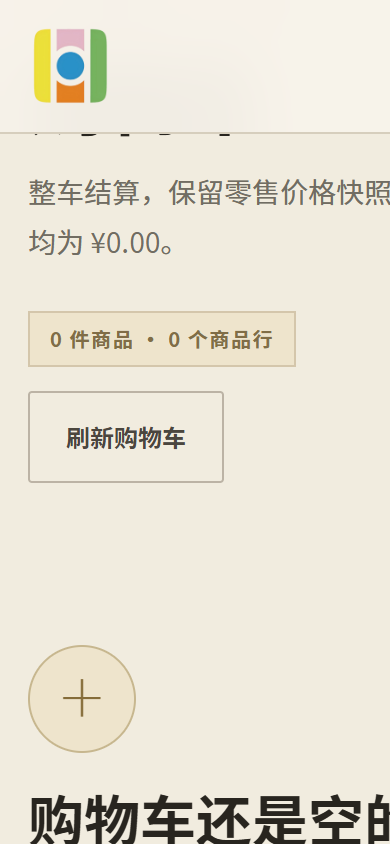
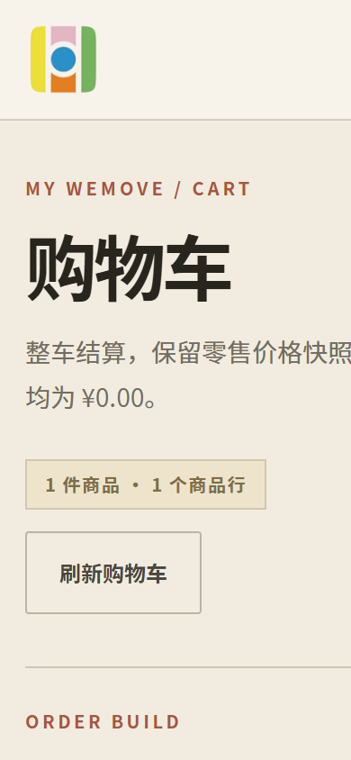
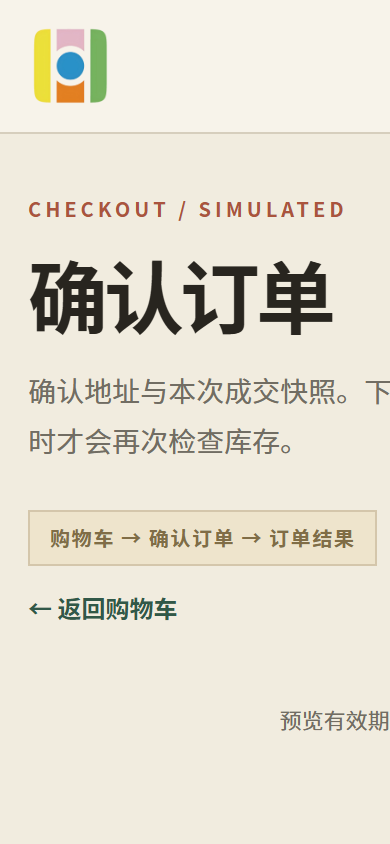
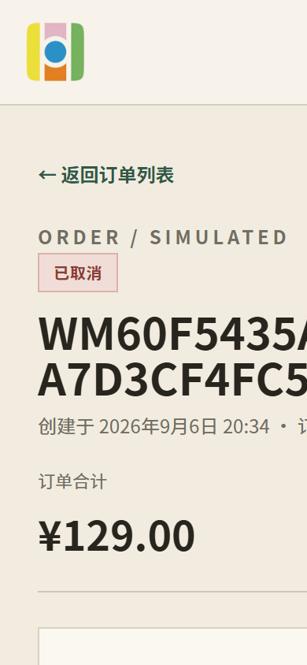
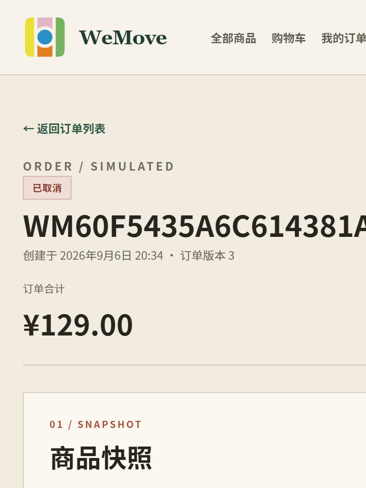
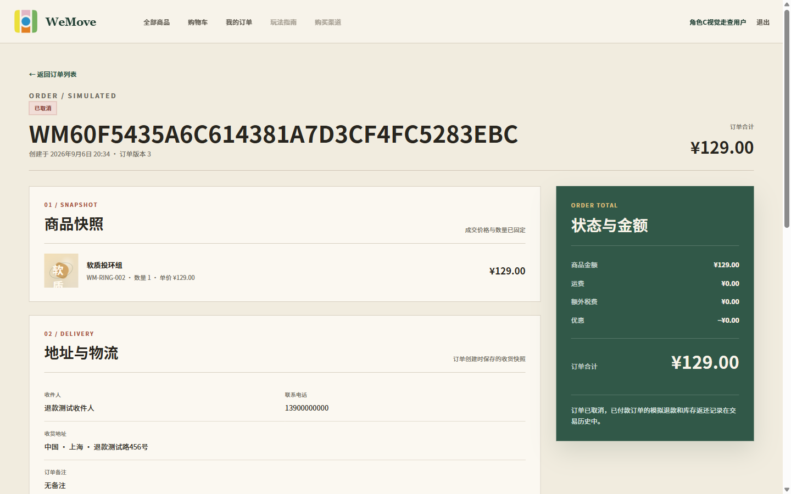
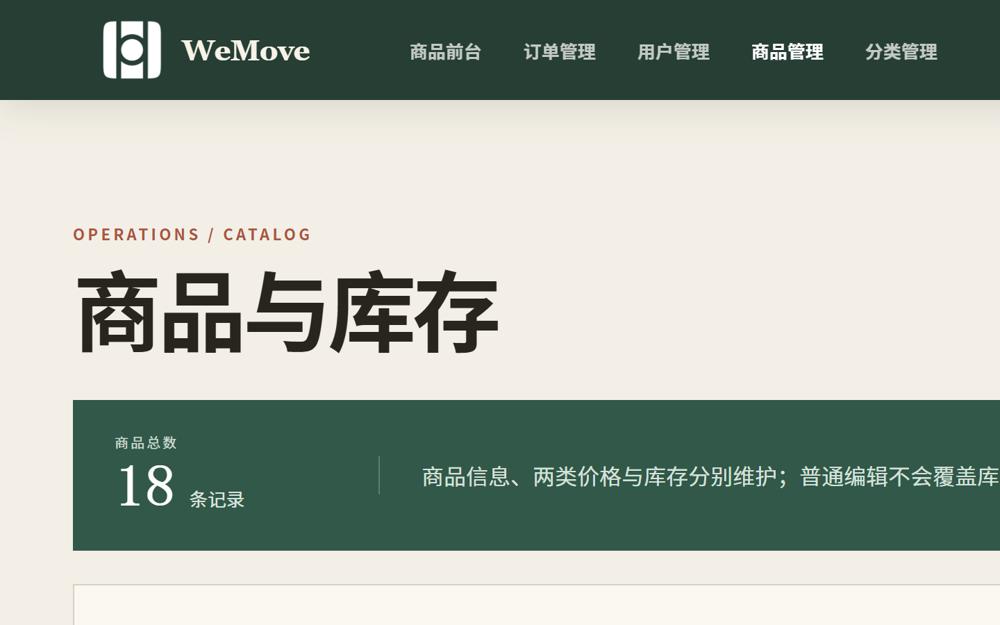
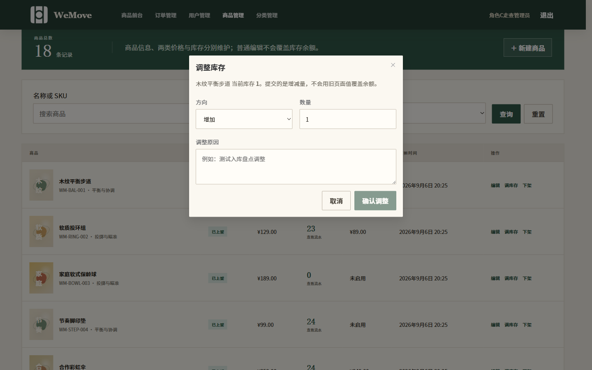
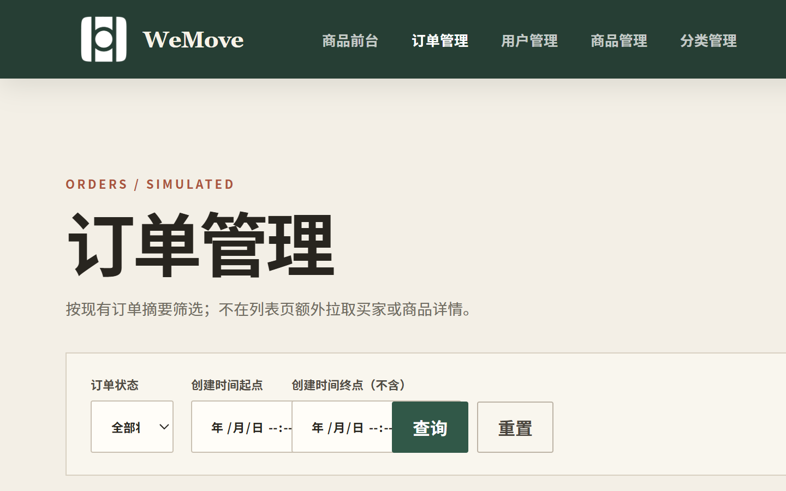
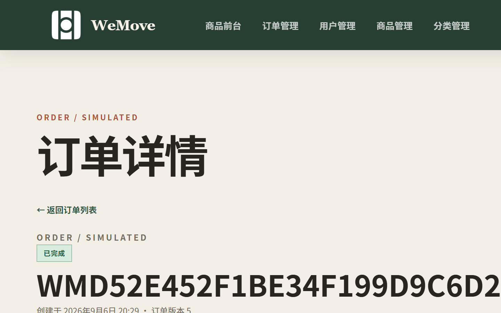

# 角色 C 统一版截图画廊

[返回验证记录](../../../modules/commerce/验证记录.md) · [返回走查报告](走查报告.md)

截图来自 2026-09-06 本轮真实浏览器操作，数据为隔离 MySQL 中的合成账户、地址与模拟交易。文件名中的 `1440`、`768`、`390` 表示复查视口；截图只取页面首屏或当前操作弹窗，不代表完整页面高度。

## 用户端窄屏

### 390px 购物车空状态

### 390px 带商品购物车

### 390px 结算表单

### 390px 已取消并退款订单

### 768px 已取消并退款订单

## 桌面端

### 1440px 已取消并退款订单

### 1440px 管理员商品列表

### 1440px 库存调整弹窗

### 1440px 管理员订单列表

### 1440px 管理员完成订单详情

