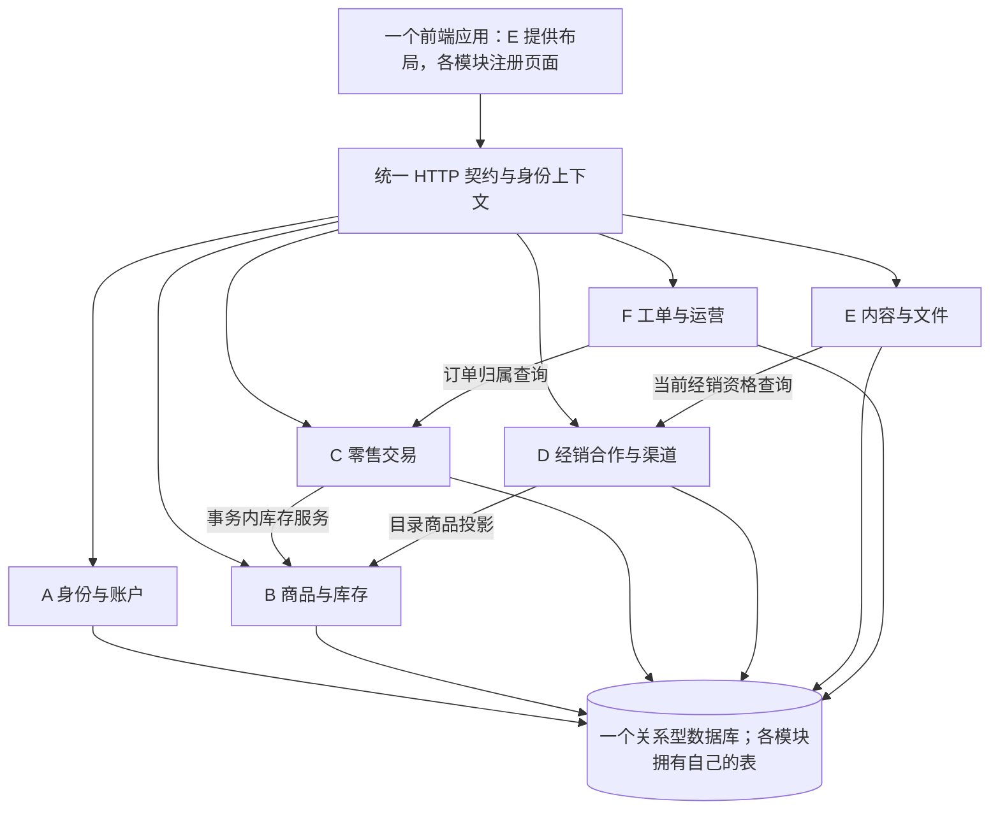

# WEMOVE 六人团队分工与协作规范

| 文档属性 | 内容 |
| --- | --- |
| 编号与版本 | WEMOVE-COLLAB V1.0 |
| 日期与状态 | 2026-09-05；建议执行稿，待团队首次设计评审确认 |
| 需求基线 | [WEMOVE 网站重构需求文档](WEMOVE网站重构需求文档.md)，SRS V1.1，原文状态为待评审 |
| 配套文件 | [接口与数据协作契约](WEMOVE接口与数据协作契约.md)、[需求责任与验收追踪表](WEMOVE需求责任与验收追踪表.md) |
| 当前前提 | 六名成员暂以 A—F 表示；技能、工期、GitHub 账号和技术栈尚未提供 |
| 本次交付边界 | 制定分工和设计规范；尚未建立应用、配置远程仓库规则或执行业务测试 |

## 1. 总体方案与软件工程依据

采用**按业务纵向分工、统一工程底座、契约先行、持续集成**的方案。每人完成自己模块的页面、业务接口、数据设计和测试，后台管理页面也随业务归属分配。例如，商品负责人同时完成商品列表和后台商品编辑，订单负责人同时完成用户订单页和后台发货页。

这是一种“垂直切片”：一个切片穿过界面、业务服务和数据库，能够独立演示一段有意义的业务。前端、后端、数据库仍然分层，只是不把整层交给一个人等待其他人接力。这样每人有完整设计成果，也能较早验证真实数据流。

统一采用**一个仓库、一个前端应用、一个模块化后端、一个关系型数据库**作为建议架构。模块化单体表示后端共同部署、模块边界清楚；不是把所有代码放进一个文件。数据库实例共享，但表和写入口有明确所有者。它让订单与库存可以使用本地事务，同时保留各模块内部组织的自由。首期不引入六套服务、跨服务分布式事务或消息中间件；未来拆分必须另行论证。

接口好比统一插头：插脚、电压和通信约定必须一致，设备内部如何实现可以不同。这里需要统一的不只是字段名称，还包括权限、状态、错误、事务和重试含义。

设提供方在合法输入上的可观察输出集合为 \(G_P\)，调用方能处理的输出集合为 \(A_C\)，稳定组合至少要求：

\[
G_P \subseteq A_C,\qquad Pre_P \subseteq \text{调用方实际遵守的约束集合}
\]

后一项用集合表示约束清单：提供方要求的每条前置约束，都须被调用方遵守。例如调用方不能只处理成功响应而忽略库存冲突，也不能把付款接口当作可无条件重复执行的普通写入。这就是**契约式设计**。契约的前置条件规定什么时候能调用，后置条件规定调用后保证什么，业务不变量规定任何时候都不能破坏什么，如 \(stock\geq0\)。

采用以下工程原则：

- **高内聚、低耦合**：同一业务的规则和改动集中在一个模块；跨模块依赖经过公开服务接口。
- **信息隐藏**：其他模块依赖能力与数据传输对象，不依赖某个类名、ORM 实体或表的具体拆法。
- **关注点分离**：界面处理展示，服务端决定权限与业务结果，数据库约束守住最终一致性。
- **单一事实来源**：SRS 管业务规则，接口契约管通信格式，迁移文件管数据库版本；避免在聊天、Mock 和代码里维护互相冲突的定义。
- **持续集成**：小功能完成后就合入并验证组合效果，不等六个人各做完一个大分支再集中联调。

## 2. 六人职责与交付边界

### 2.1 核心分工表

每行的负责人对该模块端到端结果负责，协作者负责评审或配对工作。负责人不是唯一有权修改代码的人，跨模块修改通过 PR 与所有者协作。

| 成员 / 模块 | 主责需求 | 前端与后台页面 | 后端及所属数据 | 横向责任 / 主要评审搭档 |
| --- | --- | --- | --- | --- |
| A：身份与工程底座 `identity` | FR-09、10、11、12、31 | 注册、登录、个人资料、账户管理；个人中心入口中的身份信息 | 用户、会话、成人与说明确认；身份上下文、账户停用、限流、公共错误处理 | 工程初始化、环境与 CI、迁移执行器、接口汇总；F 复核权限，D 复核资格联动 |
| B：商品与库存 `catalog` | FR-03、04、05、26、27 | 商品搜索/筛选/详情；后台商品、分类、价格、库存 | 商品、分类、零售价与经销参考价、库存余额与流水；向 C/D 提供商品投影 | 数据字典与 ER 图汇总；C 复核库存，E 复核文件引用 |
| C：零售交易 `commerce` | FR-13—18 | 购物车、结算、模拟付款、本人订单；后台订单、取消与模拟发货 | 购物车、订单、明细与地址快照、模拟付款/退款、状态历史；调用 B 的库存能力 | 交易状态机与并发用例；B 主复核，F 独立验收 |
| D：经销合作与渠道 `dealership` | FR-08、22、23、24、25、30 | 合作申请、专属目录与询价；后台申请审核、企业、询价、渠道；公开渠道查询 | 申请版本、企业合作资格、询价/回复/快照、公开渠道；经销访问策略 | 经销流程与权限矩阵；A 复核授权，B/E 复核目录与文件 |
| E：站点、内容与文件 `content` | FR-01、02、06、07、28、29 | 全站壳、导航、基础状态页、首页/品牌/文章/FAQ/下载；内容与媒体后台 | 品牌设置、Banner、推荐关系、文章、FAQ、媒体/文件版本与引用 | UI 基础规范、响应式与可访问性；B 复核引用，D 复核私有资料 |
| F：客户支持与运营观测 `support` / `operations` | FR-19、20、21、32 | 联系/咨询、我的工单；工单处理、后台总览与只读操作日志 | 工单、公开消息/内部备注；统计编排、审计记录公共入口与查询 | 测试报告、集成验收组织、讨论结论汇总；C 复核订单归属，A 复核审计 |

**工作量不能按 FR 个数直接判定。** C 的事务竞争和 D 的资格联动复杂；A、F 的基础设施和集成工作同样计入。E 不负责替其他五人写页面，F 不负责替其他五人补测试，A 不包办全体接口与数据库设计。

### 2.2 每人的标准交付包

每人均提交：

1. 模块设计：需求编号、业务边界、页面流程、状态与异常、依赖服务和本模块数据模型。
2. 接口契约：输入输出、权限、校验、错误、幂等与并发规则，及有效/无效样例。
3. 本模块前端与后端实现，包括对应的管理页面和响应式处理。
4. 所属数据库迁移、索引/约束、测试数据及升级影响说明。
5. 模块测试、涉及自身的跨模块测试、演示证据和运行说明增量。
6. 已合并 PR、评审记录、缺陷修复及实际工作量记录。

### 2.3 特别容易混淆的归属

| 连接点 | 唯一主责与协作规则 |
| --- | --- |
| 后台 | E 提供后台布局和导航机制；A—F 各自交付所属业务的后台页面，不另设“后台全包人” |
| 个人中心 | E 提供布局插槽；A 提供身份和资料；C/F/D 分别注册订单、工单、申请及询价入口 |
| 经销目录 | D 负责专属页面、HTTP 接口和资格检查；B 负责商品字段、两类价格、目录资格条件及内部投影 |
| 库存 | B 是唯一库存写入能力所有者；C 可在同一事务中调用它，不能复制一份库存或直接更新 B 的表 |
| 文件和商品图片 | E 负责上传、下载、引用管理；B 只保存受控引用并调用文件服务；私有文件必须逐次授权 |
| 首页推荐和文章关联 | E 管推荐关系；B 提供当前已上架商品投影；重新请求后剔除下架商品 |
| 企业与公开渠道 | 都由 D 管理，但采用独立实体和发布流程；审核通过不自动发布联系方式 |
| 统计 | F 管指标口径与聚合；各域提供只读统计服务，F 不接管各域写入 |
| 审计 | F 定义写入入口与查看页面；每个业务负责人在自己的业务成功边界内调用入口 |
| 数据库 | B 汇总 ER 图、A 维护迁移执行机制；每人设计与维护自己的表，跨域关系由两方评审 |

### 2.4 工作量与备份机制

- 初始按每人约六分之一的**可用工时**安排，保留约 20% 容量用于评审、联调和修复；这只是计划，不是最终个人贡献比例。
- 首次规划把模块拆为 0.5—2 人日的任务，记录设计、实现、测试、文档和依赖；连续两次例会检查剩余量。
- C/D 出现压力时，F 可配对承担后台列表或验收脚本，A 可协助授权和幂等设施；E 出现压力时，由使用方承担自己的图片选择/表单适配。转移具体任务，并同步 Issue 和责任表，不静默转移整个模块。
- 每个关键模块至少有一名评审搭档能启动、解释并修复；共享底座不得只有一人掌握。

## 3. 架构边界与设计自由

### 3.1 模块组合关系



图中省略公共授权、审计及部分只读依赖；完整服务接口以配套契约为准。模块间调用是进程内公开服务调用，不在同一后端内绕行 HTTP。模块可以有数据依赖，但不允许循环导入内部实现；在应用装配层注入服务接口。

### 3.2 哪些必须统一，哪些可以自由决定

| 必须统一的边界 | 模块内可自行决定 | 需要跨模块评审的变化 |
| --- | --- | --- |
| 一个前端框架/路由器、一个后端框架与版本、一套数据库与迁移机制 | 模块内部组件拆分、辅助类、业务算法、查询实现 | 增加全局依赖、改变构建配置或运行时 |
| HTTP 格式、字段类型、权限、错误码、状态枚举、金额/时间约定 | 具体服务类名、文件内部组织、非共享局部状态 | 改接口、增必填项、删除字段、改变枚举或错误含义 |
| 跨域服务签名、事务参与方式、表的写入所有者 | 所属表的内部拆分、局部索引、满足契约的并发实现 | 改被引用键、跨域迁移、改变事务边界 |
| 基础色彩/间距/表单和反馈约定、导航注册接口 | 模块布局、交互细节、局部组件和样式 | 改全局样式、通用组件参数或共享状态 |
| SRS 的数量/权限/状态/保存规则、质量目标 | 不改变可观察结果的重构与优化 | 修改需求或新增 P1/P2 范围 |

**稳定边界不等于冻结全部设计。** 只要对外契约和验收行为不变，模块内部重构无需全员批准。技术栈选型在 M0 完成：按成员熟悉程度、事务支持、测试便利和部署条件选定共同底座并固定版本；本规范不把尚未确定的框架写成既成事实。

### 3.3 建议仓库结构

以下为实施时创建的目录约定，当前并未生成应用骨架。

| 路径 | 内容与归属 |
| --- | --- |
| `course-materials/` | 课程原始资料，原位保留 |
| `project-implementation/project-requirements/` | 需求、协作设计和追踪表 |
| `apps/web/src/app/` | 前端装配、路由汇总，E 维护接口，业务成员注册路由 |
| `apps/web/src/features/{module}/` | 各业务页面、局部状态、局部组件、接口适配 |
| `apps/web/src/shared/` | 业务无关的 UI 与请求设施；E 管 UI，A 管请求/身份基础设施 |
| `apps/api/src/modules/{module}/` | 各域公开服务、业务逻辑和数据访问 |
| `apps/api/src/platform/` | 事务、认证入口、配置、错误、限流；A 维护 |
| `contracts/openapi.yaml` | OpenAPI 汇总入口；A 维护引用，各域维护自己的子文件 |
| `contracts/modules/{module}/` | 各域 HTTP 定义和请求/响应样例 |
| `contracts/shared/` | 统一 ID、金额、分页、错误和枚举 |
| `db/migrations/` | 全局有序、已应用后不可改写的迁移文件 |
| `db/seeds/` | 按域组织的测试资料、独立初始化入口 |
| `tests/contract/`、`tests/integration/`、`tests/e2e/` | 契约、真实数据库集成和浏览器业务流程测试 |
| `docs/architecture/`、`docs/decisions/`、`docs/meetings/` | 模块设计/ER 图、架构决策记录、讨论结论 |
| `.github/` | 工作流、PR/Issue 模板、CODEOWNERS；账号确定后配置 |

选型后可以调整语言专属目录，但须保持“按模块隔离、共享设施集中、契约独立”的原则，并同步仓库 AGENTS.md 与 README。禁止各人另外维护独立登录系统、顶层路由、数据库启动方式或依赖锁文件副本。

## 4. 从需求到实现的工作流

### 4.1 开始编码前的就绪标准（Definition of Ready）

一项任务进入开发前应有：需求/规则编号、验收场景、主责与评审者、依赖的契约版本、页面或数据流草图，以及权限/错误/状态说明。跨模块任务先合并契约 PR，再并行实现提供方和调用方。

契约尚未实现时，前端可以接 Mock（按契约返回样例的替身），后端按相同样例实现。Mock 应覆盖错误与角色差异，并经 schema 校验；它不能作为真实数据库、权限和事务验收的替代品。

### 4.2 一项功能的标准顺序

1. 创建 Issue，写明 FR/BR/TC、范围、输出和验收条件。
2. 涉及边界变化时提交契约与决策记录，列出消费者和迁移计划。
3. 契约评审合并后，创建短功能分支；前后端可使用已确认的接口样例并行开发。
4. 接入真实服务与数据库，运行模块测试及受影响的跨模块测试。
5. 提交 PR，搭档检查代码、契约、迁移及证据；CI 验证组合效果。
6. 合并到 `main` 后运行冒烟流程，更新追踪表和演示版本。产生回归时由引入者主修，相关模块协作。

**Git 能解决文本能否合并，不能证明业务能否组合。** 两个文件没有冲突，也可能一个把金额当元、另一个当分。因此 PR 合并必须同时经过语义评审与集成验证。

### 4.3 完成标准（Definition of Done）

- 关联 P0 行为可由页面和接口真实执行，刷新及重启后数据保留。
- 前端、后端、迁移、接口与运行说明一致；不把 Mock 写死结果计为完成。
- 正常、越权、校验失败、状态冲突已验证；涉及交易的重复、并发、回滚按 SRS 验证。
- 当前分支与最新 `main` 的组合通过相关检查；评审意见已处理。
- 无未声明的破坏性变更，敏感字段不返回，凭据不进仓库。
- PR 已合并，追踪表登记版本与证据；“开发完成但未集成”只能记为待集成。

## 5. GitHub 分支、评审与变更策略

### 5.1 分支策略

使用 `main` 加短期功能分支的流程，`main` 随时可启动和演示。不建立持续数周的个人总分支；每人可以先交一个能运行的小切片，再扩展功能。

| 类型 | 示例 | 规则 |
| --- | --- | --- |
| 功能 | `codex/feat-commerce-FR14-create-order` | 一个可评审的业务增量，通常 1—2 个工作日合并 |
| 修复 | `codex/fix-catalog-TC20-stock-race` | 链接缺陷与回归场景 |
| 契约/文档 | `codex/docs-dealer-contract-v1` | 先说明影响，再修改消费者 |
| 发布 | 标记 `v0.1.0`、`v1.0.0` | 标记已验证提交；版本标签不替代测试记录 |

开始任务前更新 `main`，从最新基线建分支。私有个人分支可整理提交；多人共用分支不重写历史。冲突由相关作者共同核对并运行测试，禁止直接选“全部保留本方”解决业务冲突。

### 5.2 `main` 合并门槛

实施时由 A 配置并截图记录：要求 PR、至少一名非作者批准、必需检查通过、评审会话解决、禁止直接/强制推送与删除；新提交后重新确认失效评审。合并采用 Squash，PR 保留设计与验证讨论。作者不能用自己的批准满足门槛。

为六人规模选择“分支更新到最新 `main` 后重跑检查再合并”；同时待合并的 PR 依次进入，前一个改变基线后，后一个重新验证。不要仅凭昨天旧基线上的绿灯合并。

GitHub 的具体分支保护能力取决于仓库可见性与套餐，M0 时核实。若界面不能强制执行某项规则，在 PR 检查清单和指定合并人流程中执行，并记录限制，不写成已启用。配置依据：[GitHub 分支保护文档](https://docs.github.com/en/repositories/configuring-branches-and-merges-in-your-repository/managing-protected-branches/about-protected-branches)。

### 5.3 评审责任

- 普通模块内部改动：至少一名搭档评审。
- 跨模块接口：提供方与受影响消费方共同确认；若作者属于其中一方，另一方须给出明确评审。
- 订单—库存、资格—权限、跨域迁移：两名非作者评审，覆盖关联域；六人足以完成，不要求全员逐项签字。
- UI 公共组件、共享依赖、构建配置：对应共享所有者参与评审；不能通过“顺便重构”改变全站。

使用 CODEOWNERS 按目录自动请求评审，实际账号确定后再写入。**同一路径列出两个 owner，并不自动要求两个人都批准**；需要两人评审的 PR 必须额外点名并检查。CODEOWNERS 本身也要由 A 与 F 复核。规则依据：[GitHub 代码所有者文档](https://docs.github.com/en/repositories/managing-your-repositorys-settings-and-features/customizing-your-repository/about-code-owners)。

### 5.4 契约变更与兼容性

| 变更 | 处理方式 |
| --- | --- |
| 增加可选响应字段 | 调用方应忽略未知响应字段；更新 schema 和样例，做消费者验证 |
| 增加枚举值、新错误码、默认排序变化 | 可能破坏调用方分支逻辑，按有影响变更评审，不机械视为“新增即兼容” |
| 删除/改名字段、改变类型/单位、增加请求必填项 | 破坏性变更；列出所有调用方、适配 PR、数据库迁移和回退方式 |
| 改权限、金额、状态或库存语义 | 即使字段没变也是行为变更；先核对是否需要修改 SRS，再改契约和测试 |
| 内部类/表重构，对外行为不变 | 模块内决定；若存在跨域外键或迁移影响，仍需相关方评审 |

采用“扩展—迁移—收缩”：先兼容旧形式，再更新调用方，最后确认没有旧消费者后移除。若在发布前确实可以一次原子部署前后端，也可用一个协调 PR 同步改完；必须确保合并后的 `main` 能运行。破坏性公开 API 需要新版本时使用 `/api/v2`，不能偷偷改变 `/api/v1` 的含义。

## 6. 数据库与运行环境协作

- 各人使用本地开发库；CI 使用临时测试库；团队集成库只有迁移/初始化流程管理。禁止六个人依赖同一张可随意重置的远程开发表。
- 结构变更全部提交迁移；命名采用 `UTC时间戳_模块_描述` 并检查唯一性。迁移工具选定后遵循其顺序规则；有前置依赖的迁移在依赖合并后生成，避免旧编号在不同环境顺序不同。
- 已应用到共享环境的迁移不可改写，修正通过新迁移。每个 PR 验证空库初始化与上一基线升级两条路径；业务逻辑通过真实业务接口生成验证数据。
- 迁移执行器是唯一执行入口，禁止服务启动时各自“自动同步表结构”；应用启动、迁移与测试重置必须分开。
- 跨域外键可以使用，但禁止跨域级联删除历史数据。变更被引用的键须双方评审；不以没有外键为借口放弃服务端引用校验。
- 事务由用例编排方开启，参与模块使用同一连接/事务上下文，不能在内层提前提交。并发规则详见配套契约。
- 环境变量仅提交名称和无秘密示例；真实密码与初始化管理员口令不入库。依赖版本、数据库/文件存储位置、启动端口由 A 在 README 固定。
- 数据库与文件存储必须持久化。测试重置显式校验测试环境和数据库名称，不允许默认连接集成/业务库执行清空。
- 代码回退不等于数据回退。先保留向后兼容结构；涉及不可逆迁移时先备份并在测试库演练恢复，不能直接执行未经验证的反向脚本。

## 7. 集成、质量门槛与进度

### 7.1 第一次联调应在开工初期完成

优先贯通“后台建商品 → 用户登录 → 商品详情 → 加购 → 下单 → 模拟付款 → 后台发货 → 本人收货”，同时建立一个“提交咨询 → 后台回复”的轻量闭环。它们验证公共布局、身份、HTTP、数据库、跨域服务和测试入口。经销资格、私有文件和询价流程随后沿相同底座接入。

不得等完整 UI、所有数据库表或整个模块完成才首次集成。每次演示从 `main` 启动，避免只演示个人分支或纯 Mock 页面。

### 7.2 建议里程碑

下表使用总可用工期比例，确认截止时间后由 A 换算日期；不假定课程还有固定几周。

| 阶段 | 工期位置 | 共同交付与退出条件 |
| --- | --- | --- |
| M0 基线与骨架 | 前 10% | 映射 A—F 到姓名/账号；评审 SRS；定技术栈、路由、权限、事务接口；仓库骨架、空库迁移和最小 CI 可运行 |
| M1 第一条真实链路 | 10%—25% | 完成上述零售最小闭环；各模块契约、样例和权限骨架进入 `main`；不要求装饰性细节全部完成 |
| M2 全部模块主流程 | 25%—60% | 公开站、工单、经销审核/询价、文件和运营功能逐段集成；所有 P0 有实现入口 |
| M3 异常与组合验证 | 60%—80% | 执行重复、并发、越权、下线、暂停、升级与重启场景；TC 覆盖完整，阻断缺陷清零 |
| M4 交付验收 | 最后 20% | 兼容性/性能/响应式验收、干净环境复现、报告/PPT/贡献汇总，标记可交付版本 |

阶段是检查点，不是把测试推迟到 M3；模块测试从 M1 起随 PR 运行。范围仍为全部 P0，延期先调整人力和切片，不擅自删需求或把功能降为静态演示。

### 7.3 CI 与验收分层

| 检查层 | 目的 | 时机与主责 |
| --- | --- | --- |
| 格式、编译/类型、依赖锁文件 | 发现基础不一致 | 每个 PR；A 建入口，各作者修复 |
| 契约校验与样例检查 | 检查 OpenAPI 引用、重复路由、schema 和前后端格式 | 每个接口相关 PR；提供方维护、消费者验证 |
| 模块规则测试 | 验证金额/状态/字段/权限等本模块规则 | 每个相关 PR；模块作者 |
| 真实数据库集成与迁移测试 | 验证事务回滚、并发、唯一约束及升级 | 每个数据或核心业务 PR；相关域共同负责 |
| 跨模块冒烟 | 防止 `main` 无法完成三条 UC 核心流程 | 合并前关键检查及合并后；F 编排、各域维护 |
| 全量验收 | 执行 TC-01—41、响应式/浏览器/性能/重启 | 里程碑与发布前；F 汇总、各作者供证、搭档复核 |

性能、种子数据、脚本/手工要求原样继承 SRS；量化值与责任见[追踪表](WEMOVE需求责任与验收追踪表.md)。发布阻断包括越权、私有文件泄漏、金额/库存错误、重复业务效果、不可恢复数据损坏，以及任一必须验收项未完成。测试失败不可通过删用例、放宽断言或改成“手工已看”绕过。

## 8. 沟通、课程交付与决策记录

### 8.1 沟通节奏

- 每个工作日异步更新：已合并事项、下一步、依赖/阻塞，链接 Issue/PR。
- 每周至少两次短联调：在共同版本上跑当前闭环；实际课时不足一周时改为每两个工作日一次。
- 接口争议由提供方与消费方先核对 SRS；涉及底座时 A 组织评审，涉及范围时全组记录决定。F 汇总**决定、理由、影响、负责人、完成期限**，不粘贴聊天记录。
- 紧急回归先恢复 `main` 可用，再定位修复；只回退故障代码且确认迁移兼容，保留问题单与复现证据。

### 8.2 课程交付责任

依据课程《课程分工》中的交付清单分配。当前工作区未发现 `course-materials/课程分工.md`，本次核对的是仓库 `HEAD` 中 `课程资料/课程分工.md` 的已有内容；最终以教师公布版本为准。

| 交付物 | 汇总主责 | 全员贡献 |
| --- | --- | --- |
| 每人一份 Web 开发技术现状报告 | 每人独立 | 结合自己的技术调研，不能用组内一份替代六份 |
| 进度计划表 | A | 报告估算、依赖、实际进度；不只填“进行中” |
| 沟通讨论记录 | F | 提供设计决定、争议结论与行动项 |
| 项目需求与设计 | D 汇总需求变更；B 汇总数据设计；A 汇总架构 | 每人确认所属需求与接口，记录与 SRS 的对应关系 |
| 测试报告与用例 | F | 每人提交模块与联调证据，评审搭档复核 |
| 答辩 PPT | E 统稿 | C 提供零售链路，D 提供经销链路，A/B/F 提供架构、数据、验证证据；每人说明自身工作 |
| 可运行代码及交付包 | A 组织；轮值发布人执行 | 所有模块已合并，初始化与演示可复现 |
| 分组成员工作量占比 | F 汇总、全组核对 | 依据任务、PR、评审、缺陷、文档和实测投入，不能只统计提交数或代码行数 |

### 8.3 可直接采用的记录模板

**Issue 模板**

```markdown
任务：
主责 / 评审者：
关联 FR / BR / NFR / TC：
本次范围与验收条件：
依赖模块 / 契约版本 / 前置 Issue：
接口、数据、权限与状态影响：
实现 / 测试 / 文档预计工时：
证据链接与实际投入：
```

**PR 模板**

```markdown
解决的问题与完成后的行为：
关联 Issue / FR / TC：
涉及模块、接口与数据库迁移：
兼容性及回退方式：
验证环境、命令、结果与证据：
页面变化截图（如适用）：
所需评审者与未完成事项：
```

**决策 / 讨论记录模板**

```markdown
日期 / 参与者：
问题与候选方案：
最终决定及理由：
影响的需求 / 契约 / 数据 / 测试：
行动项、负责人、期限：
关联 Issue / PR；后续验证结果：
```

## 9. 启动检查清单

首次设计会上依次完成以下事项，完成后即可按本方案开工：

- [ ] 将 A—F 替换为姓名与 GitHub 账号，确认各人的可用工时和评审搭档。
- [ ] 确认 SRS P0 基线及技术栈，记录决策；排期只覆盖本期范围。
- [ ] 共同走读配套契约中的订单—库存、资格—文件、工单—订单三组连接点。
- [ ] 固定共同运行环境、路由注册方式、HTTP 协议与迁移执行器。
- [ ] 各域补齐机器可读接口定义和字段样例，消费者签认后开始并行实现。
- [ ] 建立 GitHub Issue、短分支、评审规则与 CI，确认权限能够实际执行。
- [ ] 从最小真实闭环开始演示，逐项登记验收状态，不把建议设计标成已实现。
