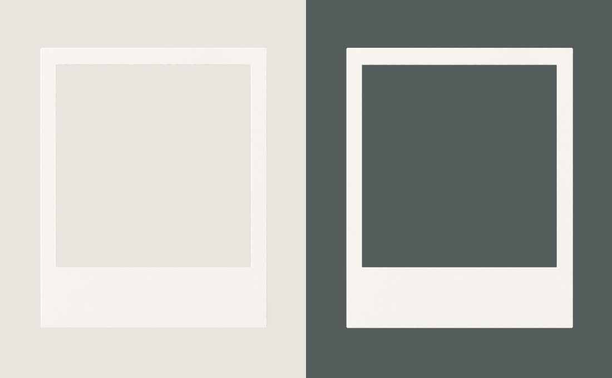

# 拍立得商品展示框

以用户提供的拍立得相纸截图为参考，使用内置 imagegen 生成轻度写实的暖白相纸框。经用户明确授权，使用本地图像处理精确清理中央窗口、外部背景和边缘；保留不透明纸面原有的颜色与纹理。

## 文件

| 文件 | 用途 |
|---|---|
| [拍立得商品展示框.png](拍立得商品展示框.png) | 正式素材，1149 × 1369 像素，中央窗口和外围均透明 |
| [拍立得商品展示框预览.png](拍立得商品展示框预览.png) | 深浅背景对照，仅用于查看展示框效果 |

## 外观与使用

- 暖白色哑光相纸，细微纸纹和克制的边缘明暗，保持轻度写实。
- 顶边与左右边较窄，下边约为窄边的 3.7 倍，保留拍立得的宽底边特征。
- 正视、无倾斜；中央是近方形透明窗口，没有照片、文字或商品。
- 将商品图片放在正式 PNG 下方，通过窗口显示。宽底边可供后续叠加商品名称等内容。
- 窗口边界约为左上角 `(139, 127)`、右下角 `(1013, 1036)`，约 874 × 909 像素；坐标基于原始 PNG 画布。缩放时按比例处理，可让商品图片在窗口四边各多覆盖 2～3 像素，以隐藏拼接缝。

## 检查

已验证中央窗口内部和画布四角完全透明；不透明相纸区域的 RGB 像素与选定生成稿保持一致。已在深、浅两种背景下检查边缘，没有明显棋盘格残留、毛刺或散点。

## 选定生成稿的提示词

把参考中的拍立得相纸制作成可直接叠在商品图片上方的中空相纸框素材：去掉里面的建筑照片，也去掉相纸外的背景，只保留一张洁净暖白色拍立得纸框。保持参考的外形比例（宽高约5:6）、等宽的窄上边和左右边、约3.4倍宽的空白下边，中间是正方形开窗。轻度写实，细微哑光纸纹和薄薄的自然纸边明暗，纸框平整正面朝向观看者，不倾斜。中央开窗和相纸外围均完全抠空，输出真正带Alpha透明通道的PNG，不能画灰白棋盘格、白底或任何填充。无照片、无文字、无商品、无道具、无大面积投影。

生成稿的透明区域最初带有棋盘格；正式素材已按用户授权清理为真实透明通道，未重新绘制相纸纹理。提示词中的比例是生成请求，成品实际窗口尺寸以上述文件数据为准。
