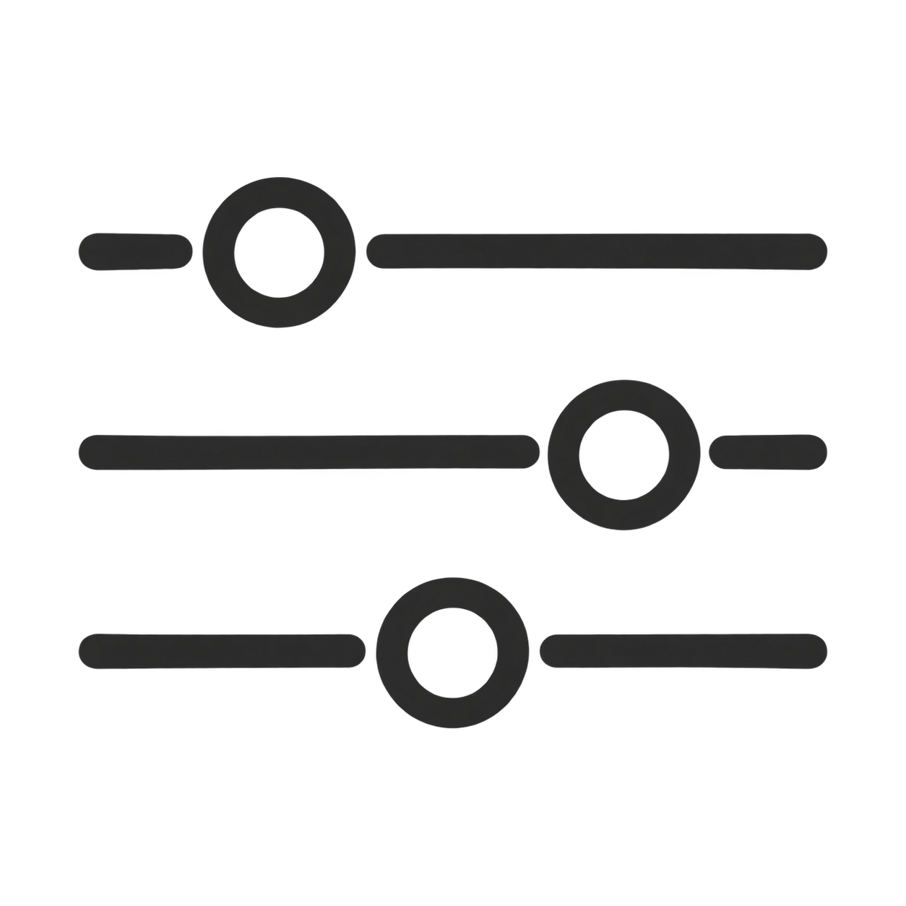
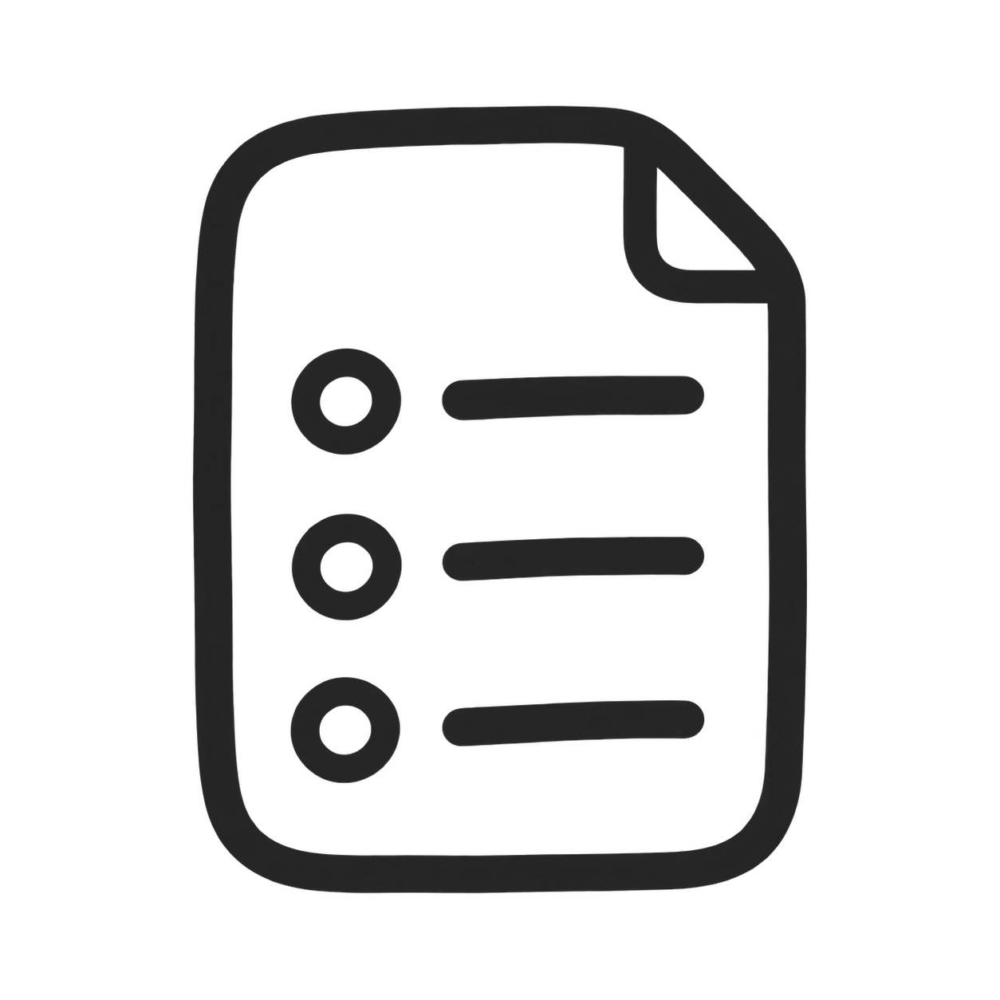
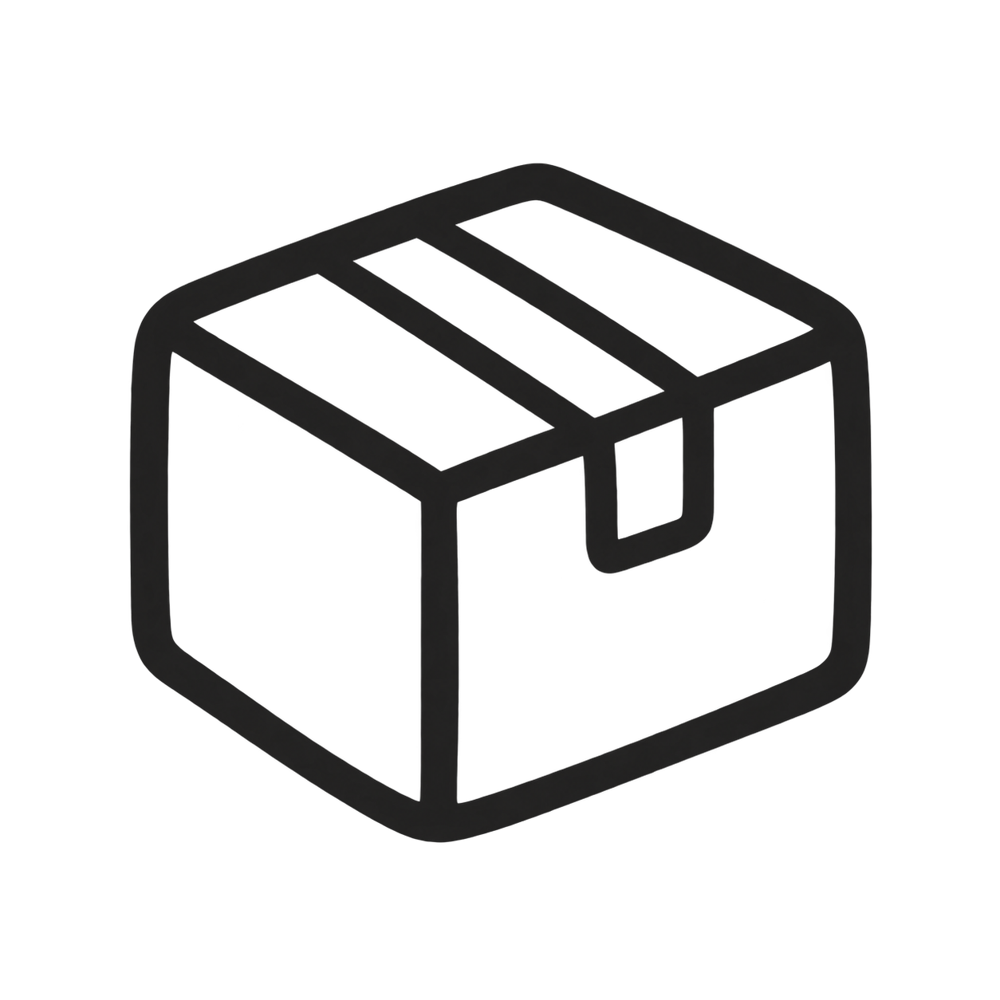
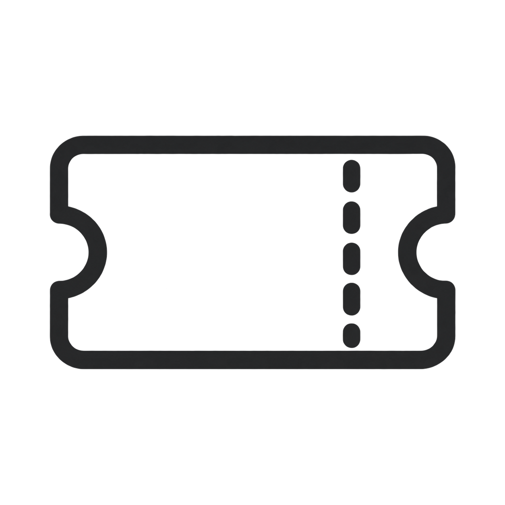
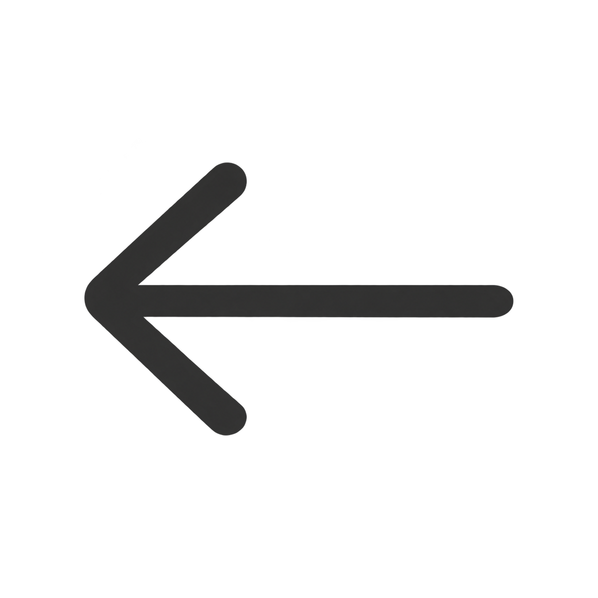

购物网站常见的图标，可以按使用场景来整理：

| 使用场景 | 常见图标 | 常用图形 |
|---|---|---|
| 页面导航 | 首页、分类、菜单 | 小房子、四宫格、三条横线 |
| 查找商品 | 搜索、筛选、排序 | 放大镜、调节滑杆、上下箭头 |
| 用户功能 | 个人中心、收藏、浏览记录 | 人物轮廓、爱心、时钟 |
| 购买操作 | 购物车、添加、减少、删除 | 购物车、加号、减号、垃圾桶 |
| 订单物流 | 我的订单、待付款、待发货、待收货 | 清单、钱包、包裹、货车 |
| 售后服务 | 客服、退换货、帮助 | 对话气泡、回转箭头、问号 |
| 营销活动 | 优惠券、礼物、限时活动 | 票券、礼盒、秒表 |
| 界面操作 | 关闭、返回、展开、分享 | 叉号、左箭头、下箭头、分享符号 |

## 全套手绘组件

表格中的 **27 个常用图形已全部具备**：1 张原始购物车参考图、前两批绘制的 6 张图片，以及本批补齐的 20 张图片。所有文件均为独立透明 PNG。

延续参考图的深炭灰粗线、圆润收笔与轻微手绘起伏。点击图片名称可打开原图；查看 [组件预览](组件预览.html) 中的 24、32、48 像素尺寸对照，或阅读 [绘制说明与提示词](绘制说明.md)。

## 页面导航

| 首页：小房子 | 分类：四宫格 | 菜单：三条横线 |
|---|---|---|
|  |  |  |
| [手绘小房子.png](手绘小房子.png) | [手绘四宫格.png](手绘四宫格.png) | [手绘三条横线.png](手绘三条横线.png) |

## 查找商品

| 搜索：放大镜 | 筛选：调节滑杆 | 排序：上下箭头 |
|---|---|---|
|  |  |  |
| [手绘放大镜.png](手绘放大镜.png) | [手绘调节滑杆.png](手绘调节滑杆.png) | [手绘上下箭头.png](手绘上下箭头.png) |

## 用户功能

| 个人中心：人物轮廓 | 收藏：爱心 | 浏览记录：时钟 |
|---|---|---|
|  |  |  |
| [手绘人物轮廓.png](手绘人物轮廓.png) | [手绘爱心.png](手绘爱心.png) | [手绘时钟.png](手绘时钟.png) |

## 购买操作

| 购物车：购物车 | 添加：加号 | 减少：减号 | 删除：垃圾桶 |
|---|---|---|---|
|  |  |  |  |
| [手绘购物车.png](手绘购物车.png) | [手绘加号.png](手绘加号.png) | [手绘减号.png](手绘减号.png) | [手绘垃圾桶.png](手绘垃圾桶.png) |

## 订单物流

| 我的订单：清单 | 待付款：钱包 | 待发货：包裹 | 待收货：货车 |
|---|---|---|---|
|  |  |  |  |
| [手绘清单.png](手绘清单.png) | [手绘钱包.png](手绘钱包.png) | [手绘包裹.png](手绘包裹.png) | [手绘货车.png](手绘货车.png) |

## 售后服务

| 客服：对话气泡 | 退换货：回转箭头 | 帮助：问号 |
|---|---|---|
|  |  |  |
| [手绘对话气泡.png](手绘对话气泡.png) | [手绘回转箭头.png](手绘回转箭头.png) | [手绘问号.png](手绘问号.png) |

## 营销活动

| 优惠券：票券 | 礼物：礼盒 | 限时活动：秒表 |
|---|---|---|
|  |  |  |
| [手绘票券.png](手绘票券.png) | [手绘礼盒.png](手绘礼盒.png) | [手绘秒表.png](手绘秒表.png) |

## 界面操作

| 关闭：叉号 | 返回：左箭头 | 展开：下箭头 | 分享：分享符号 |
|---|---|---|---|
|  |  |  |  |
| [手绘叉号.png](手绘叉号.png) | [手绘左箭头.png](手绘左箭头.png) | [手绘下箭头.png](手绘下箭头.png) | [手绘分享符号.png](手绘分享符号.png) |
